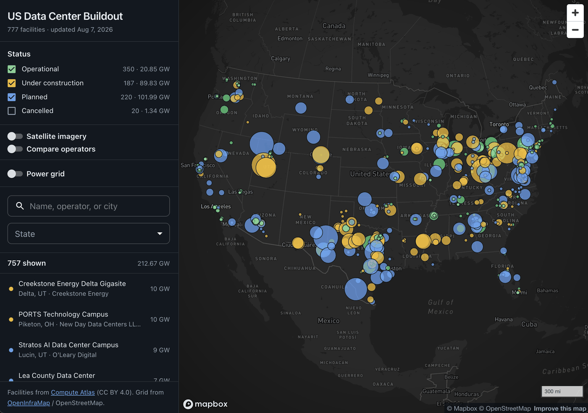

# US Data Center Buildout Map

An interactive map of data centers across the United States — operational, under construction, and planned — with every facility traceable to a public source.



No backend. The app is a static Vite/React bundle that reads a GeoJSON snapshot from `public/data/`.

**Stack:** React 19 · TypeScript · Vite · MUI · Mapbox GL. Data from [Compute Atlas](https://www.compute-atlas.com) (CC BY 4.0) and [OpenInfraMap](https://openinframap.org) / OpenStreetMap.

## Setup

```bash
npm install
cp .env.example .env.local   # then paste your Mapbox pk.* token
npm run data:refresh         # downloads the dataset (~890 facilities)
npm run dev
```

`npm run data:refresh` must be run once before the app has anything to draw. After that it maintains itself — see below.

## How the data stays current

You should never need to run the refresh script by hand again. Three things keep it current, and none of them can stop the app from opening:

1. **`npm run dev` and `npm run build`** run the refresh first via `predev` / `prebuild`, with `--max-age 12 --soft`.
2. **`--max-age 12`** skips the refresh entirely if the snapshot is under 12 hours old, so restarting the dev server is instant and doesn't pester the upstream API.
3. **`--soft`** means a refresh failure is a warning, never an error. Offline, API down, rate-limited — the script logs it, leaves the existing snapshot untouched, and the app starts with the data it already has. Stale data beats no data.

The daily GitHub Actions workflow keeps the committed snapshot current for anyone who clones or deploys.

`npm run data:refresh` still exists for forcing an immediate refresh, and it fails loudly (exit 1) rather than softly — that's the behaviour CI needs.

## Data

Source: [**Compute Atlas**](https://www.compute-atlas.com) — an open, source-cited dataset of US compute infrastructure, licensed CC BY 4.0.

`scripts/refresh-data.mjs` pulls `https://www.compute-atlas.com/api/facilities` (public, unauthenticated, CORS-open, 60 req/min) and writes `public/data/facilities.geojson`. If the API is unreachable it falls back to the CC-BY snapshot published in the Compute Atlas GitHub repo.

```bash
npm run data:refresh          # data centers only — excludes crypto mining
npm run data:refresh:crypto   # include crypto mining sites

# Rebuild offline from a local copy of the upstream JSON:
node scripts/refresh-data.mjs --from ./facilities.json
```

Commit the regenerated `facilities.geojson` when you want the deployed map to move.

### Daily refresh

`.github/workflows/refresh-data.yml` runs at 09:17 UTC daily (and on demand via **Actions → Refresh data → Run workflow**). It regenerates the snapshot and commits it **only when the facility data actually changed**.

That last part matters: the script hashes the features alone, excluding the `asOf` timestamp. Without it, every run would produce a new timestamp, a new diff, and a junk commit every single day — burying real dataset changes in noise. On an unchanged dataset the script leaves the file untouched and the workflow exits without committing.

The workflow needs `contents: write`, which is set in the file. If your repo settings restrict workflow permissions, enable **Settings → Actions → General → Workflow permissions → Read and write**.

### Status buckets

Compute Atlas uses five statuses. The map collapses them into four buckets:

| Bucket               | Compute Atlas status      | Colour  |
| -------------------- | ------------------------- | ------- |
| Operational          | `operational`             | green   |
| Under construction   | `under_construction`      | amber   |
| Planned              | `proposed`, `permitted`   | blue    |
| Cancelled            | `cancelled`               | grey    |

The underlying value is preserved as `rawStatus` on every feature and shown in the detail panel, so the proposed/permitted distinction is not lost. Cancelled sites are hidden by default.

### Interactions

- **Hover a map point** → tooltip with name, operator, status and capacity, anchored to the facility so it holds still while the cursor moves inside the circle.
- **Hover a grid asset** (when the power layer is on) → asset type, name, operator, voltage or MW output, and lifecycle status. Facilities win any overlap — a transmission line crossing a campus shouldn't hide the campus.
- **Satellite imagery toggle** → switches the basemap to Mapbox aerial photography, with place labels kept on top.
- **Hover a sidebar row** → the matching point gets a halo on the map. Keyboard focus does the same, so tabbing the list lights up the map.
- **Hover either one** → the other highlights. Hover state lives in `App` as a single value that both the list and the map read and write.
- **Click a list row** → flies the map to it and highlights it. It deliberately does *not* open the detail panel, which would cover the map you just asked to see.
- **Click a map point** → opens the detail panel with sources.
- **Select a state** → fits the map to that state's facilities.

## Operator comparison

Toggling **Compare operators** gives vertical space from the map to a panel underneath. Add operators and you get a grouped bar chart of disclosed capacity in GW, split by status, plus the map and list filter to those operators.

### Operator names need merging

Compute Atlas records `operator` as free text, and the same company appears under several spellings. QTS is the worst case in the current snapshot:

```
QTS                              10 facilities
QTS Data Centers (Blackstone)     9
QTS Data Centers                  4
QTS (Blackstone)                  1
QTS / Compass Datacenters         1
```

Compared naively, QTS shows 10 facilities when it actually runs 25. 31 operator groups are affected this way — Google 34→40, Aligned 8→14, Vantage 6→13.

So merging is on by default. It is deliberately conservative:

1. Drop parenthetical asides — `QTS (Blackstone)` → `QTS`
2. Take the lead party of a joint venture — `OpenAI / Oracle / Crusoe` → `OpenAI`
3. Strip legal suffixes — `TierPoint, LLC` → `TierPoint`
4. Fold keys that extend another **at a token boundary** — `qts data centers` → `qts`

It does *not* strip generic words like "Digital" or "Technologies", which would reduce "Digital Realty" to "realty" and risk colliding unrelated companies. The token-boundary rule in step 4 is what stops `core` from swallowing `coreweave`.

**Known limitation:** taking the lead party of a joint venture means a minority partner's sites don't count toward its total — the five `OpenAI / Oracle / …` sites land under OpenAI, not Oracle. Uncheck **Merge name variants** to compare the raw strings exactly as recorded; the selection carries across the toggle.

Each chip shows a variant count, and hovering it lists exactly which raw strings were folded in.

### Operator colours

Each compared operator gets a colour by its position in the selection — operator 1 is always colour 1 — and that colour appears in four places:

- a soft **halo behind its dots on the map**
- a **bar under its group** in the chart
- a **ring on its rows** in the sidebar list
- a **dot on its chip** in the picker

**The map inverts its encoding while comparing.** Normally the dot fill is status. With operators selected, the fill becomes the operator colour and status moves to a ring around it.

Fill is a far larger area than an outline, so it should carry whichever variable is actually being asked about — and in compare mode the map is already filtered to your selected operators, making "whose is this?" the live question. Status stays fully readable in the chart below and as the ring. An earlier attempt kept status in the fill and put the operator in a blurred halo; it lost against both the dark basemap and satellite imagery, and was invisible on small dots.

Dots also get a **minimum radius while comparing**. A large share of facilities disclose no capacity and otherwise render around 3px, where no colour is legible. The floor scales with zoom so it doesn't clutter the national view.

The palette had to avoid two sets of colours already on screen — the status buckets (green/amber/blue/grey) and the power grid ramp (violet→magenta). Hand-picking kept colliding: an early attempt put a periwinkle 79 units from the planned-blue dots. The final set was chosen by farthest-point search over HSL space, maximising distance from every existing UI colour and from each other, subject to ≥4.5:1 contrast against the dark basemap. Verified minimums: **121** between any two operator colours, **112** against any existing UI colour. Ordered so the first four are the most separated, since comparing two to four operators is the common case.

### Reading the chart

Bars are **disclosed capacity only**. A large share of facilities publish no megawatt figure, and Compute Atlas leaves those unset rather than estimating, so bars are a floor — an operator with many undisclosed sites looks smaller than it is. The caption under the chart reports how many of the selected facilities are undisclosed, and each bar's tooltip gives the facility count behind it.

### Reading the map

- **Circle area** is proportional to disclosed capacity in megawatts — area, not radius, so a 10 GW campus does not swamp the map. Sites that disclose no figure render at the floor size.
- **Which capacity figure is used** depends on the bucket: operational sites are sized by built capacity, everything else by planned capacity. Phased campuses often report both, and sizing an unfinished campus by its first tranche would understate the pipeline. Both raw values appear in the detail panel.
- **Capacity totals are a floor, not a total.** Many facilities disclose no megawatt figure, and Compute Atlas deliberately leaves those unset rather than estimating.
- **Confidence** (`confirmed` / `reported` / `rumored`) is carried per record and shown in the detail panel. Not every dot is equally certain.

## Power grid overlay

Toggleable in the sidebar, off by default. Transmission lines, substations, and generation come from [**OpenInfraMap**](https://openinframap.org) as Mapbox-compatible vector tiles:

```
https://openinframap.org/map/power/{z}/{x}/{y}.pbf
```

No pipeline — the tiles are consumed live and styled client-side. `voltage` arrives already in kV. Source layers used: `power_line`, `power_substation_point`, `power_substation`, `power_plant_point`, `power_plant`.

Lines are coloured and weighted by voltage, substations sized by voltage, plants sized by MW output. Everything renders *beneath* the facility circles via `beforeId` — the grid is context, the data centers are the subject. Features tagged `disused:power` are filtered out.

### Why 115 kV and not 120

US transmission comes in standard classes: 69 / 115 / 138 / 161 / 230 / 345 / 500 / 765 kV. A 120 kV floor would cut straight through the 115 kV class, which is real sub-transmission serving 50–150 MW facilities. Roughly what each class means for a data center:

| Voltage | Typical role |
| --- | --- |
| 115–138 kV | Mid-size facility, ~50–150 MW |
| 230 kV | Large facility, ~150–400 MW |
| 345 kV | Major campus, 400 MW–1 GW |
| 500–765 kV | Backbone; gigawatt campuses interconnect here |

There is also a practical reason: OpenInfraMap's tiles only carry >100 kV lines below zoom 6, so at national zoom nothing under that floor exists anyway. The floor is adjustable in the sidebar up to 500 kV when you only want the backbone.

**Please be considerate with this endpoint.** OpenInfraMap is volunteer-run and does not charge for tiles. The overlay is off by default partly for that reason. If this ever gets meaningful traffic, self-host the tiles from an OSM extract rather than leaning on their server.

## Architecture notes

**Why no DuckDB.** The dataset is ~890 records — roughly 1–2 MB as GeoJSON. `duckdb-wasm` costs ~10 MB of WASM before it answers a query, which would make the app slower, not faster. Filtering happens in JS over a plain array and is effectively instant. If this grows to per-facility time series (hundreds of thousands of rows), revisit Parquet + DuckDB then.

**Why imagery is a raster overlay, not a style swap.** The obvious way to add satellite view is to change the `mapStyle` prop. Don't — `setStyle` tears down every source and layer added after load, so the facilities and the whole power overlay would vanish on each toggle, and re-adding them means racing `style.load`. Instead the Mapbox satellite raster is overlaid on the existing dark style, inserted before the first symbol layer so place labels stay on top. No style reload, no race, and the toggle is instant. The imagery is slightly darkened (`raster-brightness-max`) because raw aerial photography is far brighter than the dark basemap and washes out the status dots.

**Mapbox zoom expressions can't be nested.** `["zoom"]` is only legal as the direct input to a *top-level* `step` or `interpolate`. Writing `['+', <zoom interpolate>, 6]` to grow a ring around a dot is invalid, and Mapbox responds by dropping the entire layer — the map renders fine, the layer just never appears. Both halo layers were broken this way. The fix is to apply the offset inside each interpolate output instead, which is what `radiusByZoom(offset)` in `MapView.tsx` does. If a layer mysteriously renders nothing, check for a nested zoom expression first.

**Why the chart is hand-drawn SVG.** A grouped bar chart with four series is a couple of hundred lines of SVG, against ~500 kB for Recharts or Chart.js plus a version-compatibility risk that can't be checked without installing. The axis uses a 1/2/5×10ⁿ "nice scale" so tick labels stay readable across the three orders of magnitude operators span (0.03 GW to 12 GW).

**Why the facility list is hand-virtualized.** The sidebar windows ~900 rows with about forty lines of code (fixed row height, slice the visible range, absolutely position). A virtualization library would add a dependency whose API has churned across majors for no capability this list actually needs.

**Why a snapshot instead of live fetching.** The API is CORS-open, so the browser could hit it directly. A committed snapshot means instant first paint, no runtime dependency on a third party's uptime, no rate limit exposure, and a reproducible build — at the cost of running one command when you want fresh data.

## Scripts

| Command | Description |
| --- | --- |
| `npm run dev` | Refresh if stale, then dev server on :5173 |
| `npm run build` | Refresh if stale, typecheck, production build |
| `npm run preview` | Serve the production build |
| `npm run typecheck` | TypeScript only |
| `npm run data:refresh` | Rebuild the GeoJSON snapshot |

## Mapbox token

`VITE_MAPBOX_TOKEN` is inlined into the client bundle — that is normal and expected for a `pk.*` public token. Restrict it to your deployed origins in the [Mapbox console](https://console.mapbox.com/account/access-tokens/) so it cannot be reused elsewhere.

## Attribution

> Data center data from Compute Atlas by Edward Kubiak, licensed under CC BY 4.0 — https://github.com/ek33450505/compute-atlas

Basemap © Mapbox © OpenStreetMap contributors.
